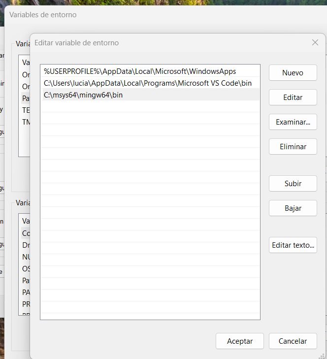
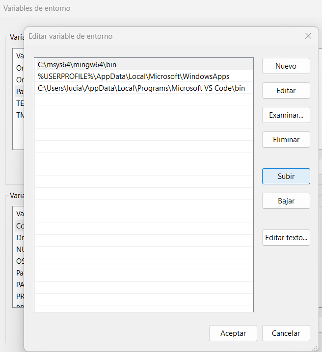
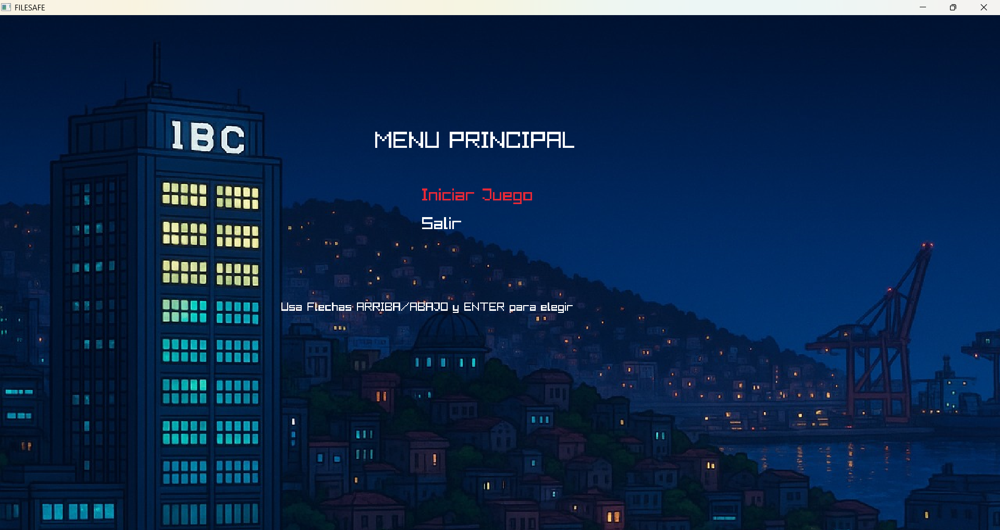
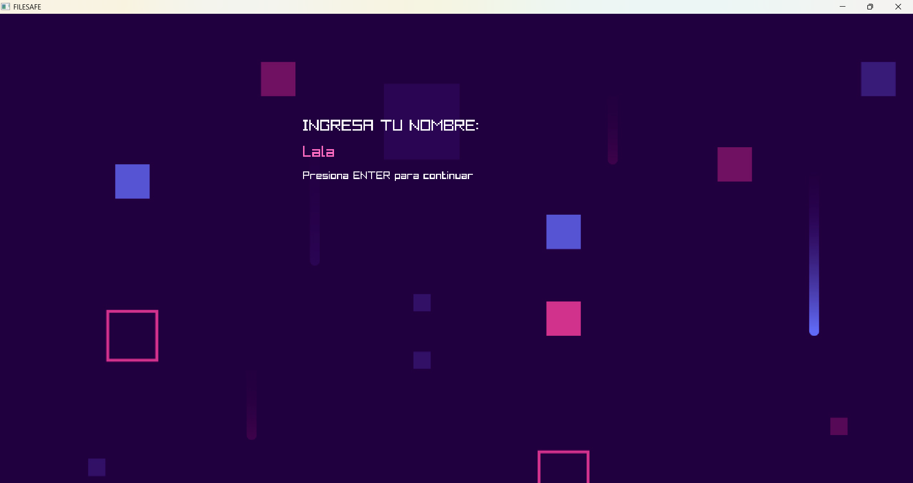
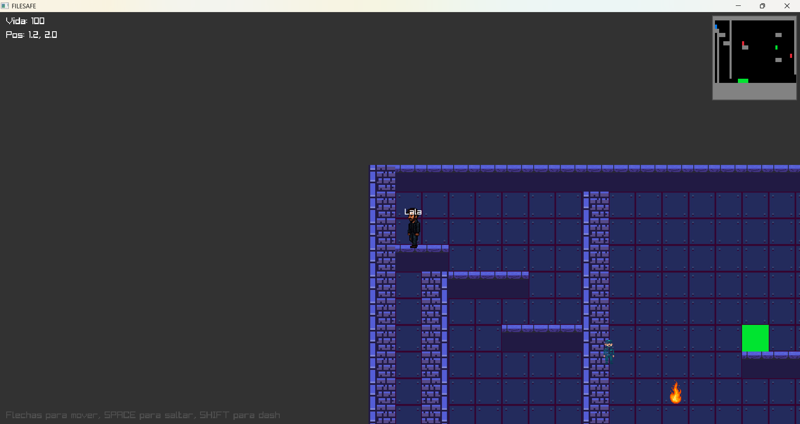
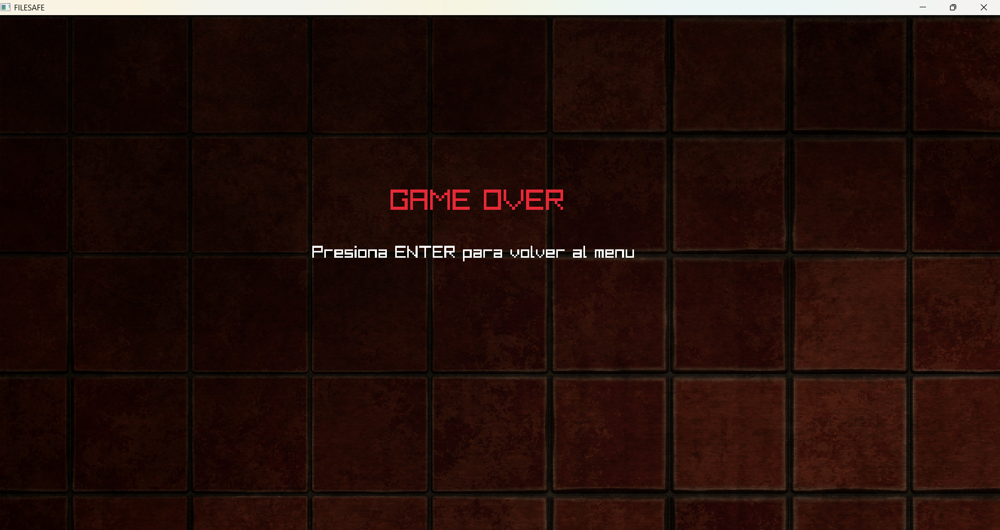

# Filesafe
Descripción: El juego Filesafe se desarrolla en un mundo distópico en el que una inteligencia artificial controla a las personas mediante un chip insertado en sus cuellos. El jugador asume el rol de un agente encargado de liberar a las personas de este control mental y de formar un equipo que le permita escapar del lugar de forma segura. Para alcanzar este objetivo, el jugador debe seleccionar cuidadosamente los ítems necesarios para enfrentarse a cada personaje y hackear su chip. Si no logra hackearlo, perderá vida, y si su vida llega a cero, la partida finalizará.

## Cómo compilar y ejecutar la tarea:
**Consideraciones previas:**
- Tener instalado Visual Studio Code.
- Tener instalada la biblioteca Raylib.

**En caso de no tener la biblioteca Raylib aqui mostramos los pasos de como instalarla:**
1.  Debes instalar MSYS2 MinGw W64. Puede hacerlo ingresando a la siguiente página: https://www.msys2.org/
Descarga e instala MSYS2 para Windows.
Presionar next de manera continua hasta que comience a cargar después de instalar msys2

2.  Ahora debes ingresar a la terminal de MSYS2 MinGw W64 y escribir el siguiente comando:
```bash
pacman -Syu
```
- Para instalar el MinGW-w64 de 64 bits.
```bash
pacman -S mingw-w64-x86_64-toolchain
```
*Acepta todo.

- Para instalar el Raylib ejecuta el:
```bash
pacman -S mingw-w64-x86_64-raylib
```
**Recomendación:** desde ahora siempre abre MSYS2 MinGW 64-bit (puedes buscarla en el buscador de tu ordenador).

3. Para verificar que has instalado bien Raylib debes ejecutar los siguientes comandos en la terminal de MinGW64:
```bash
gcc --version
```
```bash
pkg-config --libs raylib
```
Poner en el buscar del ordenador "Editar las variables de entorno del sistema", ir al botón de "Variables de entorno" y editar Path, presionar el botón "nuevo" y luego el de "examinar", después ingresar a la carpeta en que está msys64 e ingresar a mingw64 y seleccionar la carpeta bin, asi debería verse luego de seguir esos pasos: 


 y luego subir la carpeta bin al inicio de archivos que hay, asi debería verse despues de subir:


Ahora debes Ingresar al visual studio code. -Clonar en repositorio GitHub el link enviado al aula virtual:

**-----------Para compilar y ejecutar el codigo--------------**

Abre el archivo principal (por ejemplo, final2.c).

Abre la terminal con ctrl + ñ.


## Ingresar al juego en la terminal powershell:
- Para compilar el código:
```bash
./compilador
```
- Para ejecutar el juego:
```bash
./juego
```

## Opciones que funcionan correctamente y las que no lo hacen:
La opción menú de inicio (o principal) funciona correctamente, ya que permite ejecutar salida, mover arriba y abajo e iniciar el juego. Por otra parte, en el menú de pelea, luchar funciona bien, y librar funciona correctamente al cumplir la condición para poder librar al enemigo (la cual es que el enemigo tenga 10 de vida), el inventario se abre y guarda bien, el inventario de la mochila cuando usa la primera cura lo hace de manera automática y la segunda cura funciona de manera manual. Además la pantalla de Game Over funciona correctamente.

**---Observación---**

- Los botiquines fueron implementados como cuadros, debido a que ocurrian problemas al tener dos sprites juntos, es decir, los bloques de la pared y el botiquin delante del bloque generaba que ambos se unieran.
- Al mover la ventana el personaje sufre de bugs.
- Hay animaciones que quedaron pegadas al escenario, como por ejemplo un guardia pegado a la mitad de la pared.
- No se aceptan numeros ni letras con tilde en el nombre del personaje. 
- Cuando se recojen botiquines y se usan todos durante el juego (es decir el recorrido) y si vuelven a recojer botiquines, el hashmap se bugea y se cierra el juego.
- Al cerrar la ventana de lucha se cierra el juego completamente, puesto que esto ocurrió debido a falta de tiempo.

## Ejemplos que muestran cómo interactuar con la aplicación.

**------------------------------------------Ejemplo de iniciar el juego------------------------------------------**

Al ingresar a iniciar juego se dirije a la pantalla donde debe ingresar su nombre.

**------------------------------------------Ejemplo de Escribir nombre------------------------------------------**

Luego de ingresar el nombre y presionar enter, el juego comienza.

Ingreso al juego:


**------------------------------------------Ejemplo de Game Over------------------------------------------**


Al presionar enter este vuelve a la pantalla de inicio.


## Contribuciones de cada integrante y roles
**Juan Gatica:**
Descubrió y facilitó el uso de la biblioteca Raylib, permitiendo el desarrollo gráfico del juego en lenguaje C. Creó la función de carga de archivos de manera exitosa y desarrolló la lógica base de movimiento del personaje, incluyendo una mecánica de salto funcional y estable. Además, se encargó de revisar la implementación de la lógica de ataque y del juego en general. Además se encargó de que los elementos del juego se adapten a su escenario correspondiente.

**Anyara Guajardo:**
Organizó los TDAs en una carpeta dedicada, aportando a la claridad del proyecto, además de completar el diseño de los mapas. Desarrolló un prototipo de la parte gráfica inicial del juego y fue responsable de buscar y adaptar los sprites utilizados. Contribuyó con ideas para la implementación del inventario, y realizó pruebas exhaustivas del sistema de combate para detectar fallas. También revisó posibles problemas del menú de juego y lo completo, además validó el sistema de carga de archivos.


**Martina Ahumada:**
Creó el repositorio del proyecto e integró todos los TDAs. Fue la encargada de diseñar y estructurar los mapas del juego. Completó la logica de colisiones en el menú de combate, con un mínimo de errores. Se encargó de revisar el funcionamiento del HashMap, gestionar el manejo de memoria, realizar pruebas funcionales completas del juego e integrar el menú de combate al juego principal y mejorar tanto los aspectos visuales como las instrucciones del archivo README.

**Hans Gonzalez:**
Colaboró en la creación de los menús del juego y diseñó la estructura del personaje, incluyendo atributos como el nombre y la vida. Participó en el diseño del menú de combate, revisando elementos como el inventario, la vida del jugador y del enemigo, la opción de hackear NPCs para liberarlos del control de la IA, la opción inventario y también la opción de lucha. Además, se encargó de crear los NPCs e implementó el escenario de combate.

**Observación**
Si bien cada uno se encargaba de una parte del funcionamiento del codigo en específico de igual forma se recibía ayuda mutuamente corrigiendo errores, por lo tanto las contribuciones no muestra realmente si alguien realizó muchas o pocas cosas en el código, ya que se realizaron muchos otros códigos y funciones de prueba que por motivos de presentación para la entrega hemos tenido que eliminarlas. 

Por otra parte, se utilizaron los comandos commit en la terminal bash para agregar cambios nuevos al repositorio y se trabajo con una rama test para hacer pruebas de codigos.